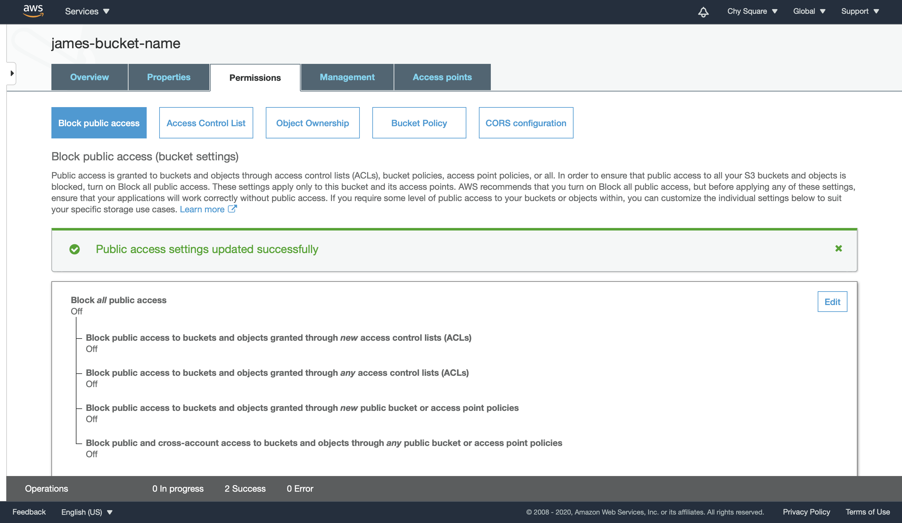

Github Actions, AWS S3 and nuxt.js are powerful tools and frameworks to deploy a web application fast. In this article, we will see how to create, build and deploy a Vue.js application. By following the below steps, you can update and deploy your app within a few seconds without visiting your AWS console nor pushing your app to Github separately.

## Table of Contents
- Creating a Vue.js app with Nuxt.js
- Configuring AWS S3
- Making / Updating Github repo
- Deploying your app

----- 

## Creating a Vue.js app with Nuxt.js
By choosing one of the following and entering the command on the Terminal, you can easily create a Nuxt app.

`yarn create nuxt-app <project-name>`

`npx create-nuxt-app <project-name>`

`npm init nuxt-app <project-name>`

It will ask some questions related to:
- Programming language (JavaScript vs TypeScript)
- UI Framework (Bootstrap, Bulma, Tailwind CSS or etc.)
- Nuxt.js modules (Axios, PWA or Content)
- Linting tools (ESLint, Prettier or etc.
- Testing framework (Jest, Ava or etc.)
- Rendering mode
- Deployment target
- Development tools
- CI

and a full list of questions with frameworks is available [here](https://github.com/nuxt/create-nuxt-app/blob/master/README.md). These days, I try to be more familiar with TypeScript, so I chose TypeScript this time. Once everything is finished, I see the following image. (Note that `yarn` is there because I chose `yarn` as a package manager)


Looks like everything is ready to proceed!


-----

## Configuring AWS S3

### S3
Here, we assume that we have an AWS account. Move to the S3 page, and create a S3 bucket button. Note that:
- The bucket name must be globally unique (i.e. you may not choose your or other's bucket names)
- Turning on versioning, server access logging and other logging is optional. You can always turn it on and off later.
  - Versioning, however, cannot be turned off once it is turned on.

After creating your bucket, you see a page similar to the following screenshot:


### Static Website Hosting
To host a website on S3, we also need to turn on the "static website hosting" mode. Click "Properties" and "Static website hosting."


Enter index.html for both "Index document" and "Error document," and click the save button.

### Granting Public Access
NOTE: Granting public access to a S3 bucket is not a recommended approach for security reasons. This tutorial focuses on providing information of hosting an app on S3. Using CloudFront & S3 together and setting up security configuration is desired.

Visit the "Permissions" section, and click the "edit" button. Toggle off the checkbox of "Block all public access" and enter confirm to proceed.




### yarn generate
To deploy the app on S3, we need to do `yarn generate` first. Go to the working directory on the Terminal, and enter `yarn generate` to create a `dist` folder. 


### Deploying on AWS Console
This step is not necessary for deploying the app using Github Actions. If you are interested in using the AWS console to deploy the app first, please find the below.

To deploy, we use files inside of the `dist` folder. Visit your AWS S3 bucket page, and click the "Upload" button. And, add all files and folder (`_nuxt`) like the below.


For fast deployment using S3, we give public read access to the object(s). 
Note that public access at a bucket level and at an object level are two different concepts. Allowing public access at a bucket level, but not at an object level or the other way around results in the access denied error.


Now, your website is ready! Go to the "Properties" tab and click "Static website hosting." You can visit your website by clicking the endpoint.

-----

## Making / Updating Github repo

Using Github actions, you can commit and push your version to your Github repo and deploy that version to your S3 bucket at the same time. Create `push.yml` that contains the following:
```
name: CI/CD
on:
  push:
    branches:
      -  master
  pull_request:
    branches:
      - master
jobs:
  build:
    runs-on: ubuntu-latest
    steps:
    - uses: actions/checkout@v1
    - name: Configure AWS Credentials
      uses: aws-actions/configure-aws-credentials@v1
      with:
        aws-access-key-id: ${{ secrets.AWS_ACCESS_KEY_ID }}
        aws-secret-access-key: ${{ secrets.AWS_SECRET_ACCESS_KEY }}
        aws-region: REGION-NAME
    - name: Build static site
      run: yarn install && yarn build
    - name: Deploy static site to S3 bucket
      run: aws s3 sync ./dist/ s3://s3-bucket-arn --delete
```
- NOTE 1: AWS_ACCESS_KEY_ID and AWS_SECRET_ACCESS_KEY must be defined in the [`credentials` file in a folder named `.aws` in your home directory.](https://docs.aws.amazon.com/cli/latest/userguide/cli-configure-files.html)

The `push.yml` file must be saved in the `.github` folder that is inside of your working directory.


